```{r setup, include=FALSE}
knitr::opts_chunk$set(echo = TRUE)
```

# Abstract


# Introduction
The soil is one of the largest terrestrial reservoirs of carbon, containing approximately three times more carbon than the atmosphere or the vegetation on Earth (IPCC, 2021). Soil carbon is released to the atmosphere as carbon dioxide (CO2) through decomposition of organic matter by microbes (heterotrophic respiration) and root respiration (autotrophic respiration). This process (i.e., soil respiration) constitutes the main carbon efflux into the atmosphere (ref). Under the new climate change scenarios increases of CO2 efflux from soils are expected (Schlesinger and Andrews, 2000), this can imply a positive feedback to future warming if stored carbon is mobilized and carbon input to soil does not increase (Lamberty&Thomson, 2010). Because soil respiration is highly sensitive to soil temperature and soil moisture (Nissan et al. 2022), understanding the responses of soil respiration to these microclimatic conditions, which are affected by global change factors as climate change and forest management, is critical for predicting future atmospheric CO2 concentrations. Temperature affects respiration rates positively (Lloyd and Taylor, 1994), by increasing the metabolic rates of soil microorganisms and enzyme efficiency (ref). However, the relationship with soil moisture is non-linear. Low water content limit nutrient diffusion and enzymes and exert drought-stress on microbes while high water contents limits oxygen (O2) diffusion, creating anaerobic conditions that suppress aerobic microbial respiration (ref). Something here about modelling?

Forest management have the potential to affect respiration rates by modifying the microclimate. Removal of trees by forest logging increases the exposure of soil to temperature fluctuations and alter the soil water content either by decreasing water through soil evaporation or by increasing it by reducing the transpiration of water by trees (Zhang et al 2018). The degree of the response of soil will be dependent on the severity of the forest intervention. Thus, more severe forestry intervention such as clear-cuts may increase soil moisture, enhance heat and frost damage (Kovaks et al 2019; Zhang et al 2018) and it seems to reduce respiration rates (Yang et el 2022; Zhang et al 2018). Less severe interventions such as thinning, have shown to increase respiration in broadleaf forests in a meta-analysis (Zhang et al 2018). Negative effects of forest management on soil could be buffered by the addition of forest residues on soil (i.e., slash addition), which can improve the microclimatic conditions, nutrient fertility and biodiversity (ref). We do not know whether the response of soil CO2 effluxes to the microclimatic conditions (i.e. soil temperature and moisture) differs among different forest management strategies. Understanding the sensitivity of respiration to microclimate under different forest management strategies is crucial in a context of climate-smart forestry (CSF) development.

Here, we hypothesized that:
(1) logging of trees will decrease the respiration rates because of the strong decrease in vegetation activity and microbiota associated. This decrease will be compensated by addition of slash which provides labile organic matter, increasing the heterotrophic respiration. 
(2) soil respiration would be more dependent on microclimatic variables (soil temperature and moisture), in the management disturbance treatments where the vegetation was removed and where the litter layer (slash) was removed, by depletion of labile organic matter. Likewise, the sensitivity of respiration to microclimate will decrease as the time passes since the disturbance because of new fresh C input from the growth of understory vegetation
(3) the sensitivity of soil respiration to microclimatic conditions will also depend on the type of climate/forest, being the Mediterranean the less sensitive as the microbial communities will be better adapted to the strong seasonal changes in water availability.

To test these hypotheses, we have recorded data on soil respiration and microclimate every month in three replicated Quercus forests across Europe subjected to different forest management strategies during three years. We have analysed the sensitivity of soil respiration to microclimate (i.e., soil temperature and soil moisture) by constructing a mechanistic parametric model and compared to a non-parametric model (i.e., random forest). We have also explored the main drivers of variation in Q10 across different forests and forest managements disturbances.

# Material and methods


## Study sites
The study sites are located in Gamiz, Northern Spain (42°49'2.32"N; 2°37'10.67"W), Saint-Christol-d’Albion, South of France (xxx) and Dumbravita, East Romania (42°49'2.32"N; 2°37'10.67"W). According to Köppen-Geiger climatic classification, the climate in Gamiz is Oceanic, with cold and rainy winters and warm summers. In St. Christol the climate is Mediterranean, with mild winters and warm and dry summers. In Dumbravita, the climate is humid continental with warm to hot summers, and cold and snowy winters with precipitation usually distributed throughout the year (Table 1). In the three study sites, the dominant vegetation are deciduous species of Quercus. Specifically, Quercus faginea Lam. in Gamiz, Quercus pubescens Willd. in St. Christol and Quercus robur L. in Dumbravita (Table 1). In St.Christol and Dumbravita the stands are Quercus monodominant, while in Gamiz, Quercus faginea appears together with scattered Acer campestris L. and Fraxinus excelsior L., and an understory dominated by Crataegus monogyna Jacq., Juniperus communis L. and Viburnum lantana L. More characteristics of the study sites are found in Table 1.
The experimental sites have an approximate total area of 1.5 ha. In each site, three stands of 0.12 ha each and replicated in four blocks were delimited. The stands corresponded to a control and two canopy disturbance treatments, i.e., 50% thinning and clear-cut (Fig. S1). The stands from disturbed treatments (thinning and clear-cut) were in turn divided in two: on half of the stands the slash resulting from the logging (leaves and twigs) was crashed and added on top of the soil and on the other half, the woody debris resulting from logging was removed. This made a total of 5 treatments (control, clear-cut with and without slash, thinning with and without slash) per block (Fig. S1). In each of the 5 treatments, two plots were established per block making a total of 40 plots (4 blocks x 5 treatments x 2 replicates per block; Fig S1). In turn, in each plot a transect of 2m length was established for monitoring (Fig. S1). Both the canopy disturbance and the slash addition treatments together with the fencing of the entire area were carried out in October 2021 in Gamiz, April 2022 in St. Christol and March 2022 in Dumbravita.

## Soil respiration 
To measure soil CO2 efflux (i.e., soil respiration), three rings of 10 cm diameter and 8 cm high were put along the 2 m transect in each of the monitoring plots (Fig. S1). Respiration was measured by a mobile infrared gas analyser (EGM-5, PP Systems, Hitchin, UK) and an attached soil respiration chamber (SRC-1). Soil CO2 efflux (g CO2 m-2 h-1) was calculated as linear increase in CO2 concentrations within the chamber headspace. The total volume used for calculation was the volume of the chamber plus the volume of the specific ring. Measurements were done monthly in the 120 collars in each site. Measurement in Gamiz started in November 2021, in St. Christol in February 2023 and in Dumbravita in May 2022.

## Forest stand characteristics
Within each of the control and thinned stands (n=8), we recorded the number of trees to calculate tree density (No. tree per ha) and measured tree diameter at breast height (DBH; 1.3 m) to calculate basal area.

## Microclimatic variables
We measured soil moisture and temperature using TMS data loggers version 4 (Wild et al., 2019), located at the extreme of the 2 m transect in each of the monitoring plots (Fig S1). These probes have three temperature sensors positioned at +15 cm, 2 cm and -6 cm relative to the soil surface, and a sensor that measures volumetric soil moisture based on time domain transmission to a depth of 6 cm. To convert the raw TMS measurements of soil moisture to volumetric soil water content, we used a calibration curve developed by Kopecký et al. (2021). For further modelling and since these sensors measure every 15 min, we extracted the soil temperature and soil moisture measurements closer to the time we measured soil respiration in the field.

## Soil physical-chemical and enzymatic analyses
Chemical analyses and enzymes were measured on 5 soil cores of 4 cm diameter separated 0.5 m to a depth of 10 cm along the 2m monitoring transect. The five soil cores were mixed into a composite sample per plot. The composite sample was sieved through a 5-mm mesh sieve in the field, stored at -20°C and then freeze-dried prior to laboratory analyses. The pH was measured in distilled water 1:10 (w/v). The carbon (C) and nitrogen (N) content of the soil was measured using an elemental analyser: C content was measured by sulfochromic oxidation (ISO 14235), and N content was estimated by sulfuric acid mineralization with the addition of selenium and sodium sulphate and conversion to ammonium ions (ISO 11261), which were measured with the Segmented Flow Analyzer (SFA) Skalar. Available phosphorus (P) was determined after extraction with malachite green according to the protocol by Ohno & Zibilske (1991). Bulk density was measured in each of the plots by collecting 3 soil cores of 6 cm diameter and 10 cm depth around the 2m transect that were mixed into a composite sample. Soil bulk density was determined by dividing the dry mass of the composite sample by the volume of the 3 cores, after removing the stones. Soil C stocks (g m2) were calculated by multiplying C concentration by bulk density and sampling depth.
The activity of extracellular enzymes involved in SOM decomposition was measured through enzyme assays developed by Štursová & Baldrian (2011). Briefly, the activity of cellobiohydrolase, β-galactosidase, β-glucosidase, β-xylosidase, lipase, chitinase, α-glucosidase and acid-phosphatase  were measured at pH 5.0 in 1:100 (w/v) sample slurries using methylumbelliferol-based substrates, with an excitation wavelength of 355 nm and an emission wavelength of 460 nm. Product quantification was based on standard curves with a range of 4-methylumbelliferol concentrations in the same sample slurry.

## Microbial biomass
The same five soil cores used for chemical analyses were used to estimate soil microbial biomass. To do that, we extracted Phospholipid fatty acids (PLFAs) following Šnajdr et al. (2008). Lipids were extracted using approximately 1g of dry soil with a mixture of chloroform:methanol:phosphate buffer (1:2:0.8) and separated by solid-phase extraction cartridges (HyperSep Silica SPE columns 200 mg/3 mL, Thermo Fisher Scientific). PLFAs were eluted using 2 mL of methanol. The selected fractions underwent to mild alkaline methanolysis and the methyl esters of PLFAs were analyzed by gas chromatography-mass spectrometry (GC-MS; 450-GC, 240-MS ion trap detector, Varian, Walnut Creek, CA). In the polar PLFA fraction, fungal biomass was quantified based on 18:2ω6,9 (fungal PLFA) content; bacterial biomass (total bacterial PLFA) was quantified as a sum of i14:0, i15:0, a15:0, 16:1ω5, 16:1ω7, 16:1ω9, 10Me-16:0, i16:0, i17:0, a17:0, cy17:0, 17:0, 10Me-17:0, 18:1ω7, 10Me-18:0, cy19:0 (Actinomycetes 10Me-16:0, 10Me-17:0, 10Me-18:0, Gram-positive i14:0, i15:0, a15:0, i16:0, i17:0, a17:0 and Gram-negative 16:1ω7, 16:1ω9, 18:1ω7, cy17:0, cy19:0). The sum of all of the selected PLFAs together with 16:0 and 18:1w9 was used as an estimate of total microbial biomass (total PLFA). 


## Data pretreatment


## Validation
In order to ensure a robust validation, all models have been validated with a split approach, keeping two completely independent data sets (80% of the points for training and 20% validation). Given the size of the dataset, we considered this approach more reliable than any cross-validation approach.


## Parametric model, constant `E_a`
We defined a parametric model to consider all the three effects on respiration we hypothesized. The first is the influence of temperature, then the influence of soil moisture, and then a seasonal component which is assumed to be roughly proportional to the interactions of autotrophic respiration (which we hypothesized following a seasonal pattern).
Temperature and moisture scaling interact linearly, while seasonality was assumed additive:  
$$
Rh(t) =  \xi_{temp(t,j, k)} \cdot \xi_{moist(t,j)} + \xi_{sin(t,j)}
$$

Where the index $j$ corresponds to the treatments and the index $k$ corresponds to the plots (minimal statistical unit), while $(t)$ denotes the variation over time of each forcing variable (temperature, moisture, or days of the year).

## Model calibration
The parametric model was calibrated in a stratified Bayesian framework, where we assigned independent parameters depending on different groping of the data.   
The model was written in Stan [@carpenter2017stan; @standev2018stancore], run from its R interface [@Rstan].
The likelihood function was defined as:  
$$
    Rh_{meas} \sim \mathcal{N}(Rh_{sim}, \sigma)
$$
Where the parameter $\sigma$ was defined as the variance of the whole dataset (0.27).

### Moisture 
The moisture scaling function was taken from a simplified version of Moyano (2013) in the SoilR package [@SierraMueller].
$$
\xi_{moist(t,k)} = a_j \cdot \theta_{v}(t) - b_j \cdot (\theta_{v}(t))^2
$$
We assumed that the variability in moisture sensitivity is driven by treatments ($j$). 
The prior distribution for the term $a$ was assumed as $\sim \mathcal{N}(3.11, 0.1)$ and for the term $b$ was assumed as $\sim \mathcal{N}(2.42, 0.1)$, utilizing as mean values the values in @SierraMueller and setting up conservatives standard deviations.

  
### Temperature
The temperature scaling function we utilized to define the relationship is the one defined by @Lloyd.1994l68 and it is derived from the original Arrhenius equation [Arrhenius.1889]:
$$
\xi_{temp(t,j)} = A_{k} \cdot e^{\frac{-Ea_j}{(T(t)+273.15)-T_0)}}
$$
The two parameters $A_{k}$ and $E_a$ are represented by Bayesian priors.  
For the temperature scaling we assumed that the activation energy term $E_a$ (which defines roughly the slope of the relationship) is driven by treatments ($j$) while the linear rescaling term $A_{k}$ is driven by the substrate at the single plot level ($k$). This is because substrate (organic matter) amount is usually highly variable in soil even at small spatial scales, while its quality, which defines its temperature sensitivity, is assumed to follow the inputs quality which are relatively uniform over each treatments.  
The effect of the rescaling term $A_{k}$ is included in the function for temperature scaling to keep the convention of the original formulation of the equation, but it could be brought outside since it just a linear interaction.  
The prior distribution for the term $A$ was assumed as $\sim \mathcal{N}(300, 100)$ and for the term $E_a$ was assumed as $\sim \mathcal{N}(398.5, 50)$, utilizing as mean values the values  in @Lloyd.1994l68 and setting up conservatives standard deviations.


### Seasonality
In order to correct for eventual seasonality patters, we introduce also a seasonality scaling.
The seasonality scaling functions assume a sine function with period = 365 days, with both amplitude $ampl_j$ (the magnitude) and peak day $peak_j$ (when the function is at its only annual peak) varying as a function of treatments:
$$
\begin{aligned}
    \xi_{sin(t,k)} = ampl_k \cdot sin \left(\frac{2 \cdot \pi}{365}\right) \cdot day(t) \\
    +\left(\frac{2 \cdot \pi}{365}\right) \cdot (peak_k - 1) - \frac{\pi}{2})
\end{aligned}
$$
Both the terms $ampl_j$ and $peak_j$ are described by Bayesian priors. Variance is by treatment.
We assumed that the variability in seasonality is driven by treatments ($j$). 
The prior distribution for the term $ampl$ was assumed as $\sim \mathcal{N}(0, 0.5)$, so assuming as mean no seasonality effect, and for the term $peak$ was assumed as $\sim \mathcal{N}(175, 50)$, so assuming as mean for the peak the 24th of June (Midsummer day). Amplitude can be negative (this is just reverting the order of peaks and valleys of the sine function).


## Model benchmark
The parametric model has been compared against two nonparametric machine learning models. The firs was a more conventional multiple linear regression model (default R package `lm`, @R-Core-Team_2023), and the second a random forest model (command `randomForest` from package `randomForest`, @randomForest_2021). Both models had the structure as:  
$$
Rh(t) \sim f(T(t), theta_v(t), treatment)
$$
The rationale behind these choices is to offer two extremes to compare the fitness of our parametric model with, assuming that a linear regression model will perform more poorly than the parametric model given its limited capabilities to represent relationships more complex than linear (as we assume temperature and moisture relationships with respiration), and that a random forest model will perform better than the parametric model given its plasticity. The random forest model was in this case fit with default parameters, without any other optimization.

## Model extrapolation of increased temperature effect on decomposition
Once we calibrated our parametric model, we could test the consequences of an increase in temperature on decomposition by driving the model with the same dataset except temperature was increased by 5&deg;C. This resulted in a more immediate way of visualizing the impact of a different temperature sensitivity of organic material.


## Parametric model, time-variant `E_a`
In order to test the hypothesis of an eventual variation of the activation energy of the decomposing material over time without any assumption on the function of variation, we fitted a version of the model where the $E_a$ parameter was stratified in order to let it vary independently for each treatment and year of sampling. 


```{r, echo=FALSE}
# Load necessary package
library(knitr)

# Create the data frame
df <- data.frame(
  Parameter = c("A", "Ea", "a", "b", "amplitude", "peak_day"),
  Description = c(
    "Pre-exponential factor (log)", 
    "Activation energy (Ea/R)", 
    "Scaling of Moyano function (moisture, linear term)", 
    "Scaling of Moyano function (moisture, quadratic term)", 
    "Amplitude of seasonal sine wave", 
    "Peak day of seasonal sine wave"
  ),
  `Stratification Level, const Eₐ` = c(
    "Plot", 
    "Treatment", 
    "Treatment", 
    "Treatment", 
    "Treatment", 
    "Treatment"
  ),
  `Stratification Level, var Eₐ` = c(
    "Plot", 
    "Treatment-year", 
    "Treatment", 
    "Treatment", 
    "Treatment", 
    "Treatment"
  ),
    `Prior Values` = c(
    "normal(30, 100)", 
    "normal(398.5, 50)", 
    "normal(3.11, 0.1)", 
    "normal(2.42, 0.1)", 
    "normal(0, 0.25)", 
    "normal(175, 50)"
    )
)

# Generate the table using kable
kable(df, format = "pipe", caption = "Model parameters stratification and priors")
```

## Machine learning variance decomposition
On a more limited subset (only Spain), we tested a more extensive random forest model in order to test the predictive power of other variables on the respiration. The model had structure as:  
$$
\begin{aligned}
Rh(t) \sim f(trees,  treatment, DBH, BA, pH, BD, 
P, N, C_{stocks}, \text{fungi\_biomass}, 
biom_{fungi}, biom_{bact},\\
biom_{act},biom_{gram+}, biom_{gram-}, 
biom_{tot}, \frac{biom_{fungi}}{biom_{bact}}, 
T_{soil}, M_{soil}, month)
\end{aligned}
$$

We included in this model tree density in plants ha$^{-1}$ ($trees$), average diameter at breast height ($DBH$), basal area ($BA$),  pH, bulk density ($BD$), phosophorous ($P$), total nitrogen ($N}$), carbon stocks ($C_{stocks$), fungal biomass ($biom_{fungi}$), bacterial biomass ($biom_{bact}$), actinomycetes biomass ($biom_{act}$), gram+ bacterial biomass ($biom_{gram+}$), gram- bacterial biomass ($biom_{gram-}$), total biomass ($biom_{tot}$), fungi:bacteria ratio, soil temperature ($T_{soil}$), soil moisture  ($M_{soil}$) and month of the year.
This model was tested only on a subset of the dataset (only the sites in Spain), for which all the additional variables were available.
The aim of this model was to test the predictive potential of any of these additional variables, in order to to explore eventual correlations and possible related processes. The choice of a random forest model over a more conventional linear model is motivated by the capacity of the former to consider more complex relationships and interactions, on top of the convenience of being able to assess quantitatively the predictive potential of each variable by estimating relative variable importance.

## Temperature sensitivity (Q10)

## Machine learning variance decomposition on enzymes
$$
\begin{aligned}
Rh(t) \sim f(trees, treatment, BA, BD, \\
\beta_{\text{gluco}}, \text{acid\_phos}, \beta_{\text{xylo}}, \text{chitise}, \\
\text{cellobiohydrolase}, \beta_{\text{galacto}}, \alpha_{\text{gluco}}, \text{lipase}, \\
\text{CO}_2\text{\_flux\_norm}, T_1\text{\_soil}, \text{Soil\_moist}, \text{month})
\end{aligned}
$$


# Results

## Characterization of study sites
Tree density in France was very high compared to Spain and especially to Romania where the tree density was very low (Figure 1). In contrast, the DBH was the lowest in France and the highest in Romania (Figure 1). Spain showed intermediate values of both tree density and DBH (Figure 1). For soil variables, in the untouched forest (control), the bulk density was the highest in Spain and the lowest in France. Spain had the highest pH while France and Romania had similar ranges of pH. The highest significant levels of C and N were found in Spain while the lowest C content was found in Romania. France in turn presented doubled C:N rates than the other two sites (Figure 1). Total microbial biomass, fungal biomass and bacterial biomass peaked in France, followed by Spain and it was the lowest in Romania. Similarly, in general, activities of most enzymes were higher in France compared with Spain and Romania (Figure 2).  

{width=80%}


## Effects of management disturbance treatments on soil physical-chemical and biological properties
The disturbance treatments barely affected the soil properties in Romania (Figure 1). In France, the bulk density increased as the intensity of the disturbance did (i.e., from thinning with slash to clear-cut no slash) and in Spain it significantly increased in all the disturbance treatments compared with control (Figure 1). The pH only significantly increased in both clear-cut treatments in Spain. Moreover, in Spain the N content decreased in the thinning and clear-cut without slash (Figure 1). In France, compared with controls, C content increased in all the disturbance treatment, but in the clear-cut without slash that decreased (Figure 1). In Spain, C content only decreased in the thinning-without slash treatment (Figure 1). 
Similar to soil properties, microbial biomass, fungal biomass and bacterial biomass did not change with the disturbance treatment in Romania. In Spain, these variables significantly decreased in the disturbance treatments where the slash was removed and in France only in the clear-cut treatment where the slash was removed (Figure 2). The disturbance treatments barely affected enzymatic activities in Romania and Spain, but generally decreased in clear-cut where slash was removed in France (Figure 2).

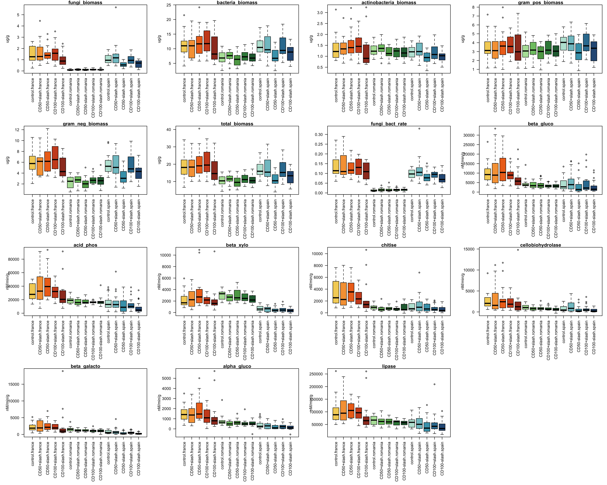{width=80%}

## Effects of management disturbance treatments on soil microclimate and respiration

As expected, in Spain the temperature variation was the lowest compared to the other two sites (Figure 3a). In general, control plots showed the lowest thermal amplitude in all sites (i.e., with higher temperatures in winter and lower in summer). In Spain, the soil temperature increased as the intensity of the tree removal, mainly in summer, but the addition of slash buffered these increases. In France, the main effect on soil temperature was the tree removal, especially in summer and this was independent on the addition of slash. Soil temperature was not affected by disturbance and post-disturbance treatments in Romania. The observed effects of the disturbance and post-disturbance treatments on soil temperature were decreasing with time.
Soil moisture fluctuated inversely with temperature. In Spain, soil moisture was higher in the clear-cut with and without slash addition, except in the driest periods (from April to August). Similarly, in Romania, clear-cut increased soil moisture independently of slash addition. Contrarily, in France, soil moisture tended to decrease in the clear-cut treatment with and without slash (Figure 3b). 
Both in Spain and France, removal of slash decreased respiration rates, independently of tree cutting intensity, and thinning coupled with slash addition kept the respiration rates as the same level as controls. In Romania, effects of the disturbances were lower, however clear-cut increased respiration rates, especially when slash was added to the soil. At the end of the monitoring period, three years for Spain and two years for France and Romania after disturbance, respiration rates increased in the clear-cut with slash addition in the three study sites (Figure 3c).

{width=60%}

## Benchmark models and parametric model fit
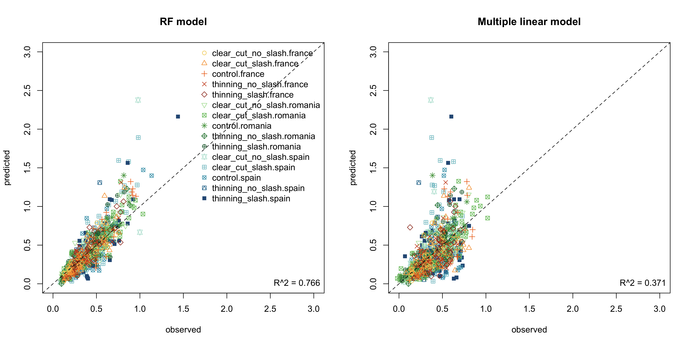{width=80%}


{width=60%}


## Temperature sensitivity (Q10) and parametric model posteriors 
The temperature sensitivity (Q10) values of SOM mineralization were consistently higher in Romania (2.9 in controls), followed by France (2.7) and Spain (2.5) (Figure S4). The activation energy (Ea) followed the same pattern as Q10 (Figure 6a, Figure S4). In general, the activation energy and Q10 values decreased with slash addition due to higher SOM quality compared with treatments in which slash was removed. This was especially evident in Spain for both thinning and clear-cut and in the clear treatment in France. The activation energy and Q10 in the treatments where slash was added did not differ from controls (Figure 6a, Figure S4). These results were consistent when the activation energy was analysed as a function of time since disturbance and the activation energy systematically decreased in all treatments and all countries with time since disturbance (Figure 7). The photosynthetic activity did not modify the sensitivity of soil respiration to temperature (peak and amplitude factors from the sine-function not affected) (Figure 6b, c). However, the amplitude of the sine-function tended to be higher in France (Figure 6c). The parameters of soil moisture function (a and b) did not change the response of the model either (Figure 6d, e).

{width=60%}

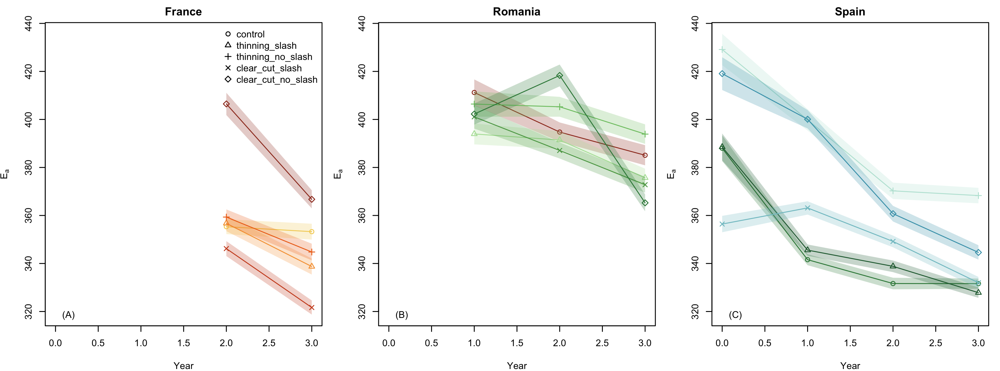{width=60%}

The variables that most variance explained of Q10 were N content and fungal to bacteria ratio and then number of trees, beta-xylosidases and soil temperature (Figure x).

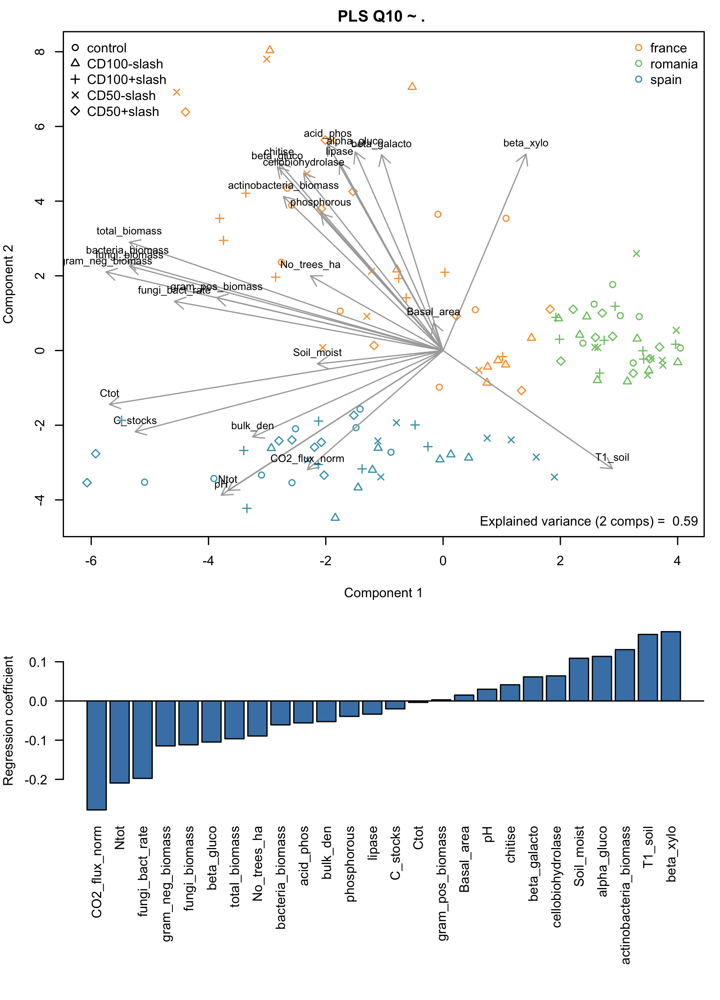{width=60%}

## Machine learning variance decomposition: predicting respiration based on edaphic, ecological and enzymatic data

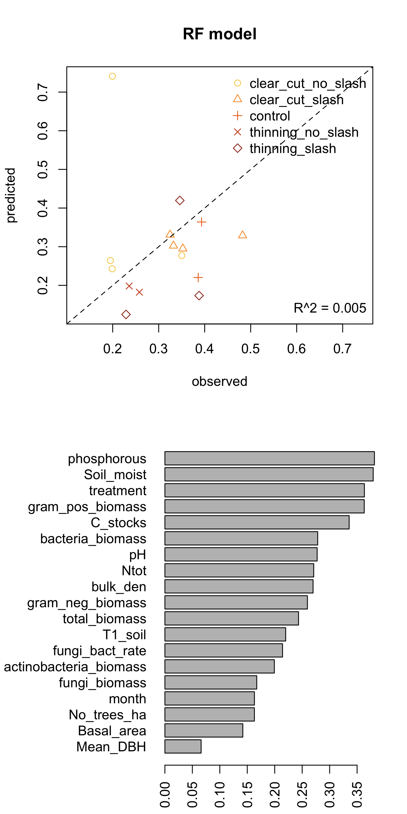{width=50%}

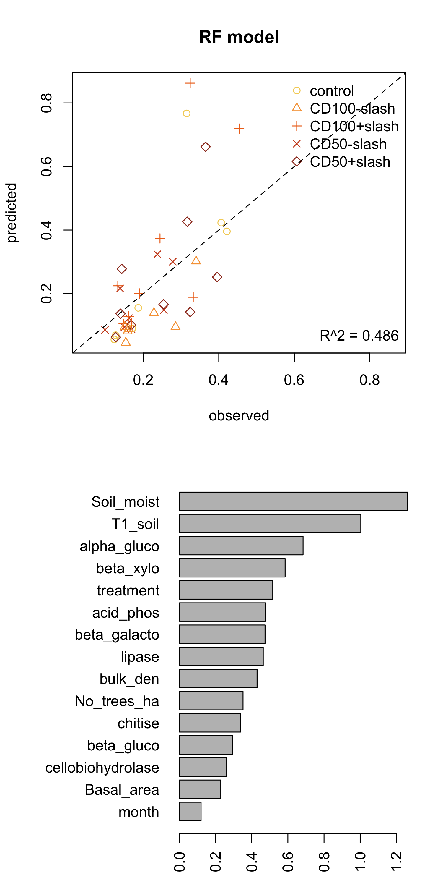{width=50%}

## Model extrapolations

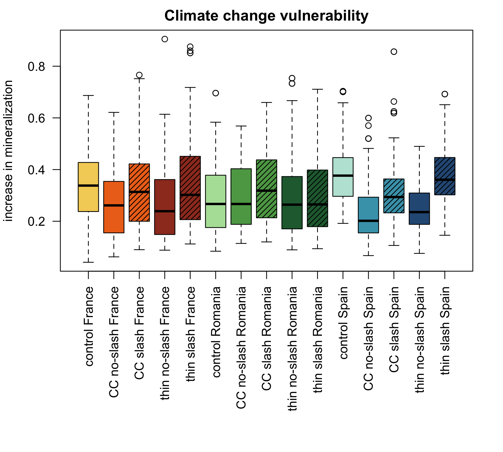{width=60%}


# Discussion
General paragraph

Hydrologic leaching of dissolved and particulate carbon compounds can also be important outputs of C from the system (Davinson and Jansen 2006), that could explained the low carbon content in Romania (sandy soil with low retention capacity). 

### Role of temperature and moisture in decomposition (model description)
Our model showed that soil temperature and moisture were able to explained more than 50% of variance in soil respiration. Because phenologial patterns in deciduous species can affect sensitivity of soil respiration to temperature (Curiel-Yuste et al 2004), in this model we have also included a seasonality scaling. The seasonal scaling although apparently differentiated slightly between sites, it always presented very low amplitude posteriors, weighting on average only a 5% of the total measured respiration. It was more important in France (between 4.5% and 12.2%) and much less in Spain and Romania (between 2.0% and 3.2%). This is probably related to higher photosynthetic activity variation of Quercus pubescens growing in a Mediterranean climate in France. This would indicate higher changes in root respiration and proliferation that would in turn affect microbial communities. Because in the three study sites there were deciduous Quercus species, another explanation is that soil respiration could have been also affected by the deciduousness of the understorey vegetation (Curiel-Yuste 2004).

## Forest management effect on activation energy and sensitivity to temperature
Generally, our results confirmed the hypothesis 1, since slash addition increased the respiration rates compared to the treatments where the slash was removed. Addition of slash created an artificial litter layer that buffered the effects over soil microclimatic conditions, and provided new habitat and food availability for soil organisms (ref). These results indicate that increases in heterotrophic respiration due to due to an increment in organic matter availability by slash addition compensated for the decreases in autotrophic respiration and root-associated microbiota due to tree logging and soil disturbance (Borkhuu et al. 2015). Moreover, the strength of the response was also dependent on the forest, being more evident in Spain and France where the tree density was much higher than Romania. In Romania such a low density of trees together with a dense understory of grasses in all treatments might explain the lack of response and indicate high degree of resilience to perturbations. 

Our results also confirmed the hypothesis 2, since addition of slash decreased the activation energy of SOM decomposition. We argue that this result is probably related to a reduction in chemical recalcitrance, supporting the carbon quality-temperature hypothesis stating that the biochemically recalcitrant C pool is more sensitive to changes in temperature than the labile C pool (Bossata and Agren 1999). Moreover, the activation energy correlated positively with the Q10, agreeing with Davidson & Janssens, 2006 and Sierra, 2012 that the higher the activation energy the higher is the relative temperature sensitivity. We have also observed a general negative trend of activation energy with time in all management disturbance treatments and all sites. This result also gives support to the C quality temperature hypothesis since fresh inputs from the new vegetation low down the temperature sensitivity of C mineralization as these inputs are more labile to decomposed (Lefevre et al 2014). Still, the growth of new vegetation, within three years from disturbance, did not compensate for the decreases in activation energies in the plots where removal of slash had an effect. Additionally, we cannot rule out the fact that other mechanisms could have contributed to low down activation energies with time such as differences between years in primary production (i.e., contribution of autotrophic respiration) or changes in substrate and enzyme diffusivity driven by differences in soil moisture between years (Davinson and Jansen 2022). In line with this, for example, in the control plots from Spain the activation energy decreased from year zero (2021) to year two (2023) and then it increased a bit, while in disturbed plots it was always descendant. Since changes in activation energy due to the growth of new vegetation is not expected in undisturbed control plots and given that 2022 and 2023 were extremely dry in Spain, probably drought exerted a constrained access of enzymes to substrates (Davinson and Jansen 2022). This suggest that drought effect may have similar impacts on temperature sensitivity as chemical recalcitrance (Levegre et al 2014).

## Role of edaphic, ecological and microbiological variables in temperature sensitivity
The Q10 values obtained in our study were comparable to the Q10 values measured in the field by other studies (ref). Xu et al 2015 observed the largest relative frequency of Q10 values across forest in China was within the range of 2.0–3.0. Fierer et al. (2006) observed Q10 values ranging from 2.2 to 4.6 (average of 3.0) at continental-scale in an incubation experiment. Still, we observed a large variation of Q10 depending on the forest, being the highest in Romania. This is in agreement with the known higher temperature sensitivity in colder regions (Koven et al 2017). The reason could be related to longer time of frozen soils that could reduce the diffusion of substrates and extracellular enzymes within the soil (Davinson and Jansen 2006), giving higher values of Q10 not related to recalcitrance.   

Our analyses revealed the three variables that explained most of the variation of Q10 were related to i) the quality of substrate (i.e., nitrogen content as limiting nutrient in forest), ii) the microorganisms, in particular, fungal to bateria ratio and iii) the primary productivity (that is, the number of trees). 


## Consequences of different temperature sensitivity of organic material in reacting to warming


# Conclusions


# References
\bibliography{references}


# Appendix


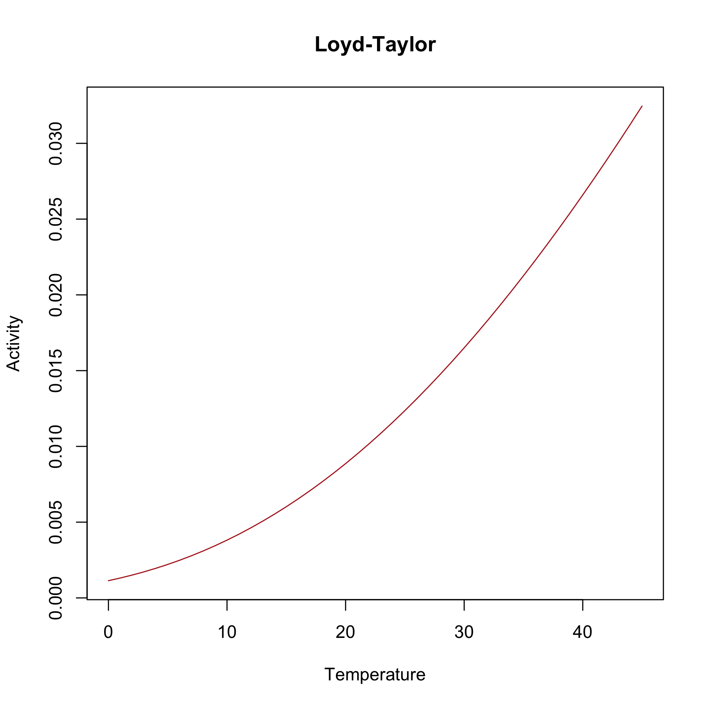{width=50%}


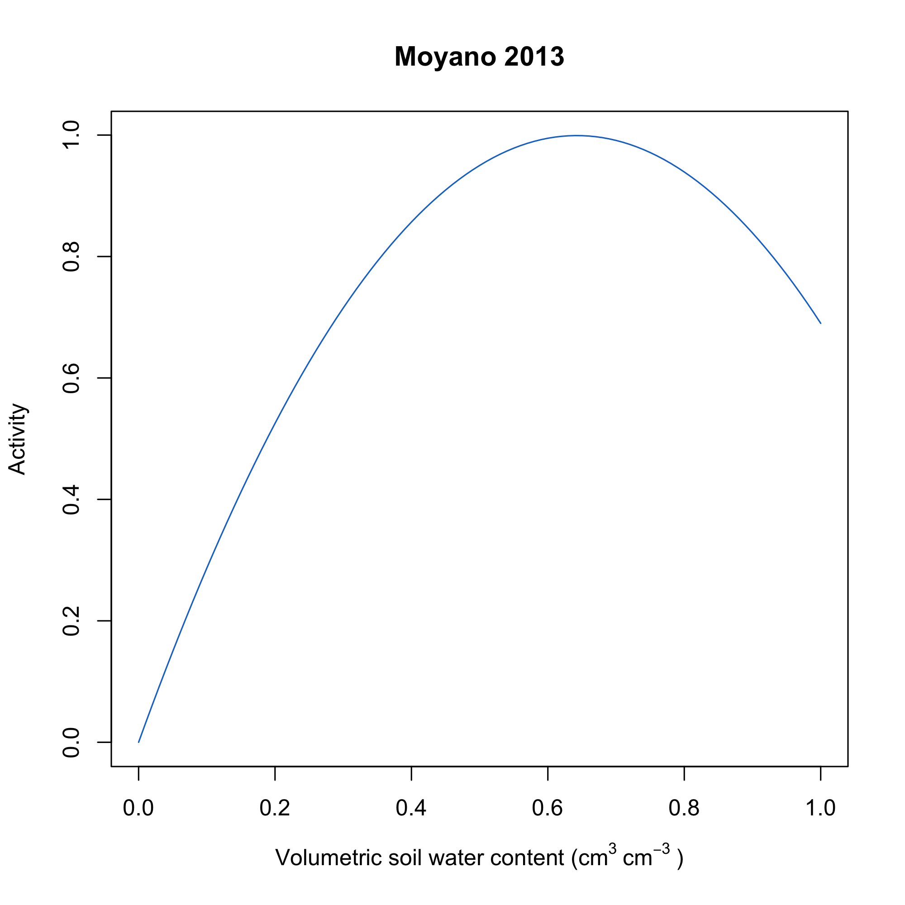{width=50%}


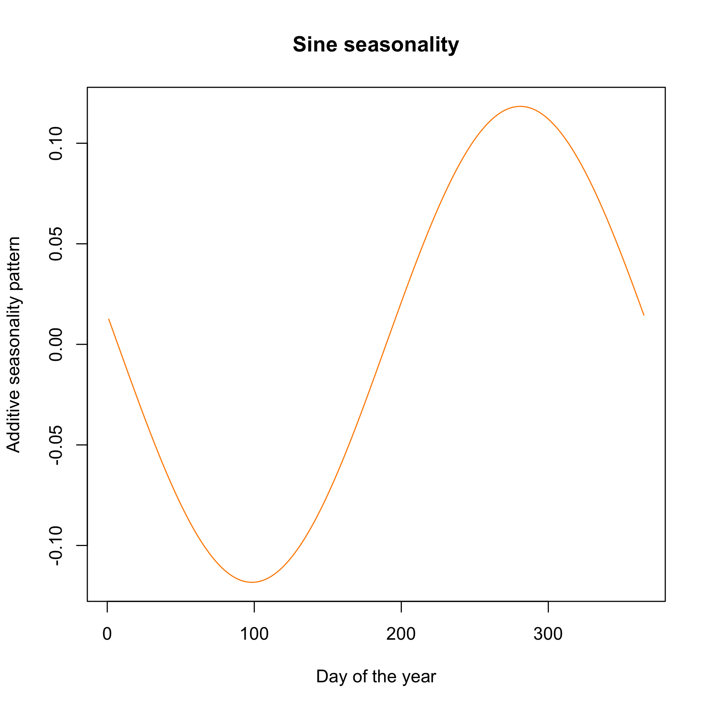{width=50%}


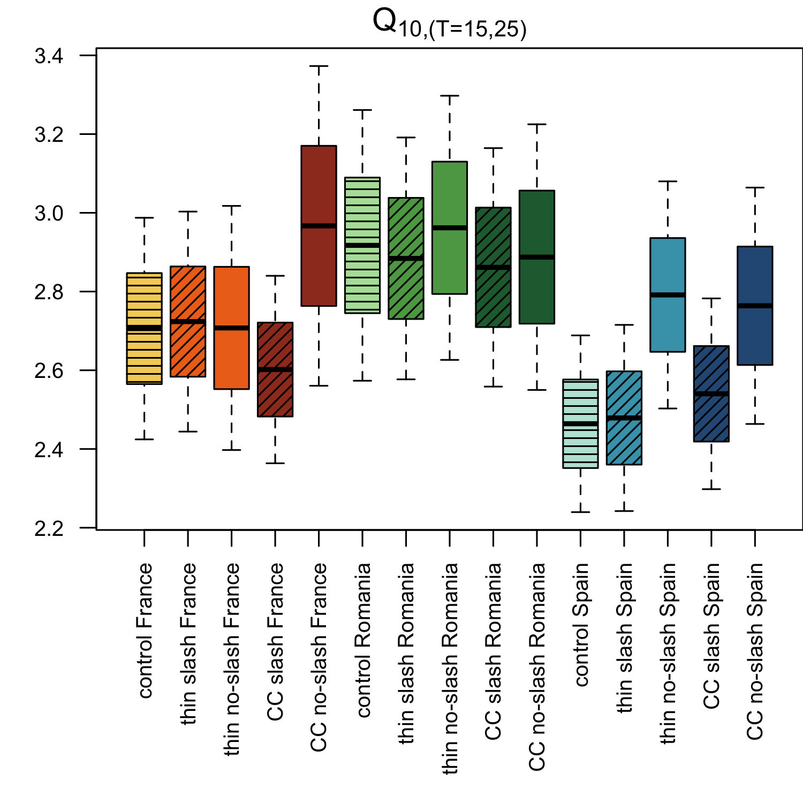{width=60%}

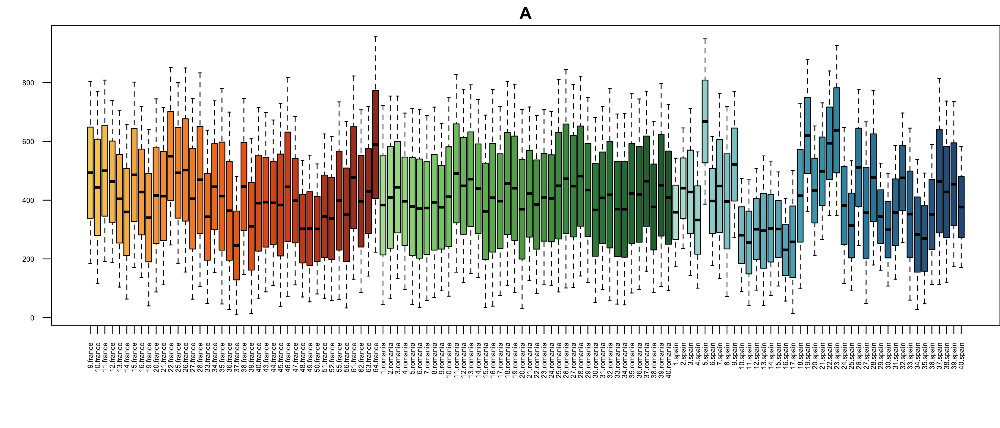{width=60%}

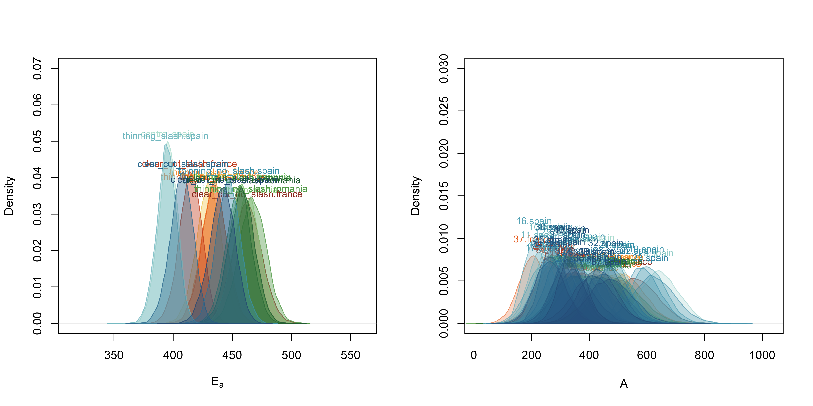


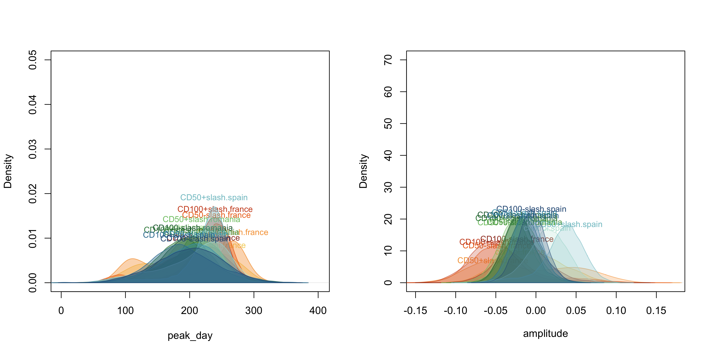


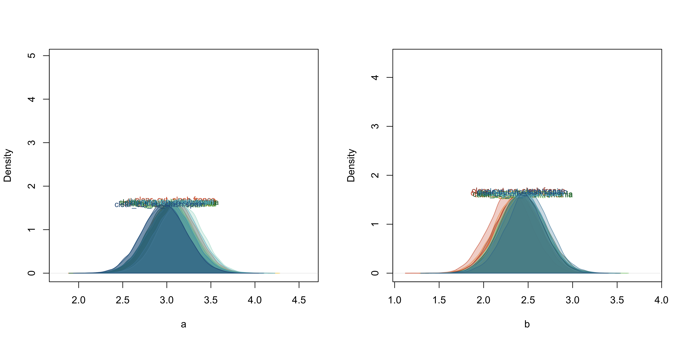

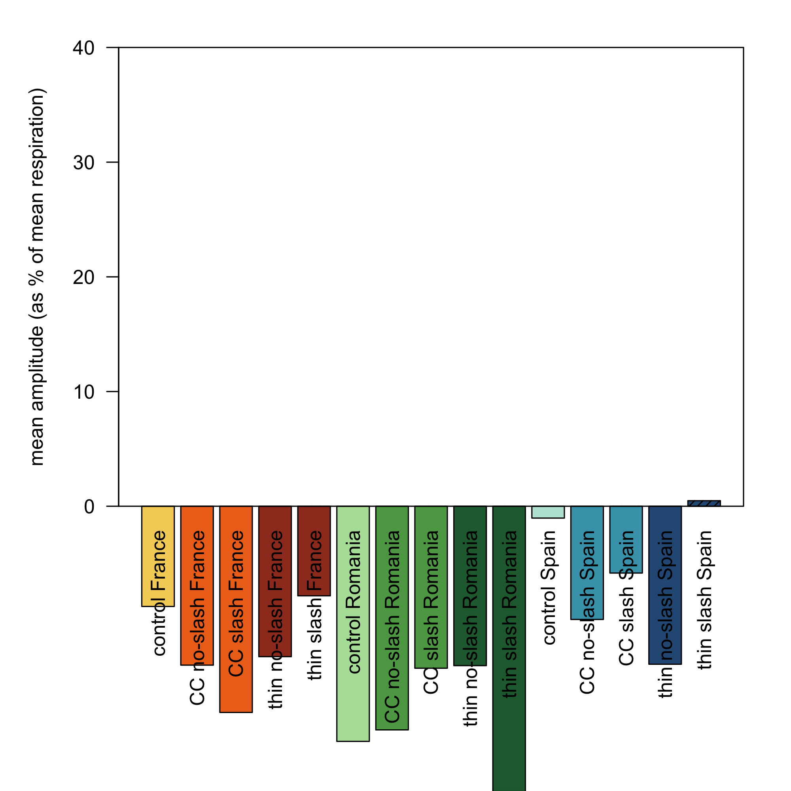


```{r, echo=FALSE}
library(knitr)
posteriors <- read.csv("../Tables/posteriors_summary.csv", stringsAsFactors = FALSE)
kable(posteriors, escape = FALSE, caption = "Table 1: posterior probability distributions of the prameters, constant Ea")
```

```{r, echo=FALSE}
library(knitr)
anova_results <- read.csv("../Tables/Enzyme_means.csv", stringsAsFactors = FALSE)
kable(anova_results, escape = FALSE, caption = "Table 2: ANOVA Results for enzyme activities")
```


```{r, echo=FALSE}
library(knitr)
anova_results_edaph <- read.csv("../Tables/Edaphics_means.csv", stringsAsFactors = FALSE)
kable(anova_results_edaph, escape = FALSE, caption = "Table3: ANOVA Results for edaphic and ecological variables")
```


