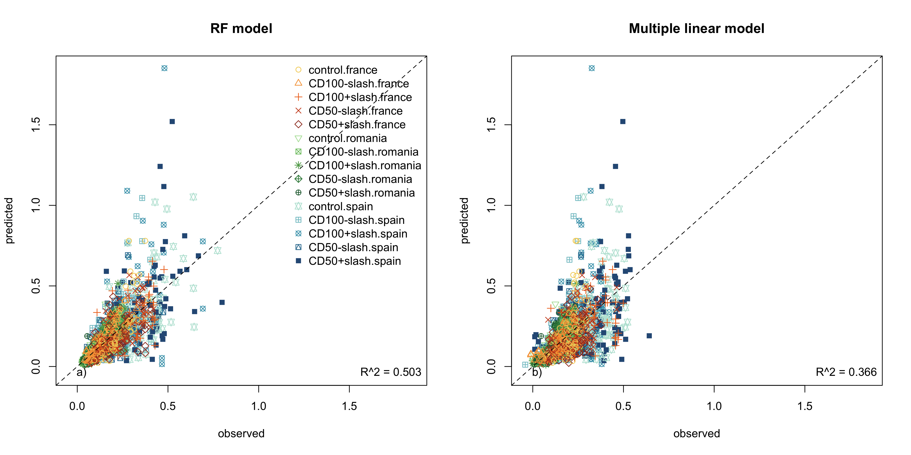
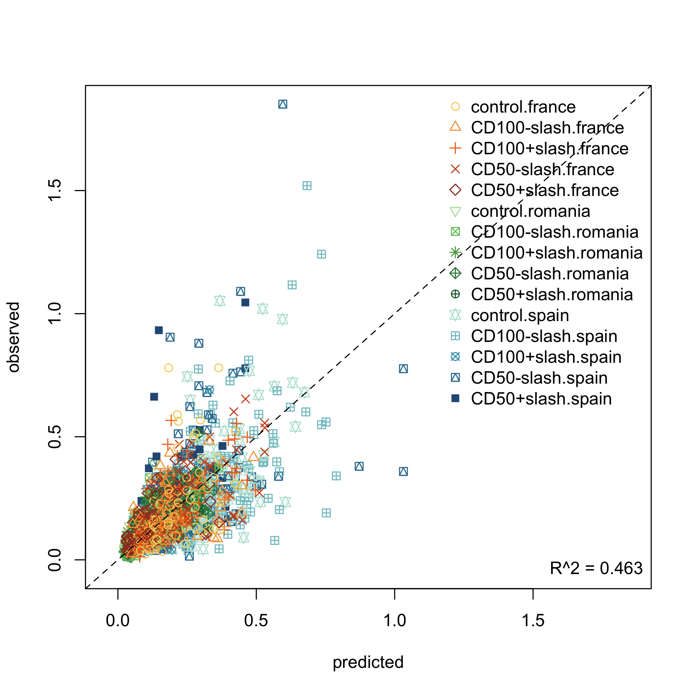
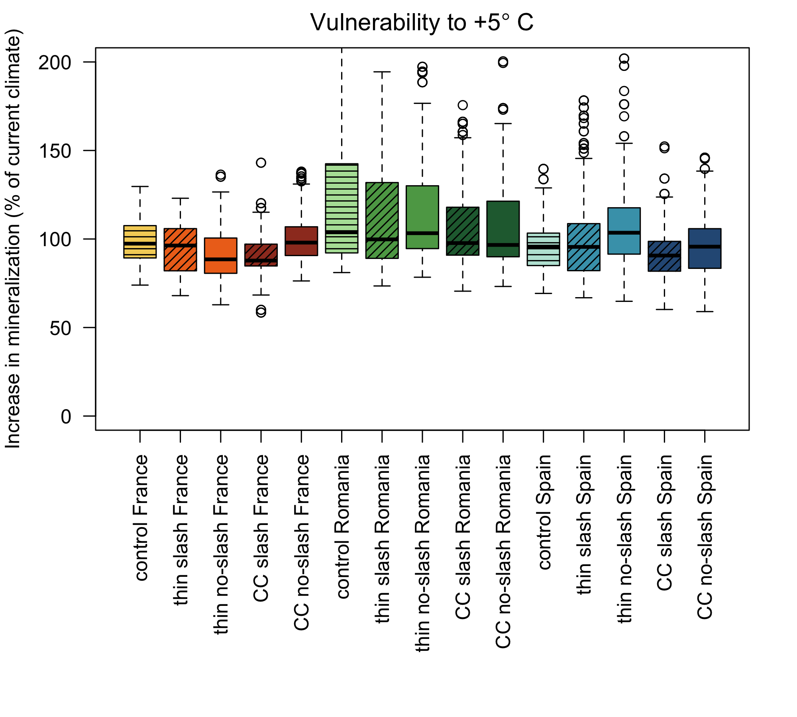

```{r setup, include=FALSE}
knitr::opts_chunk$set(echo = TRUE)
```

# Abstract


# Introduction

# Material and methods


## Study sites
The study sites are located in Gamiz, Northern Spain (42°49'2.32"N; 2°37'10.67"W), Saint-Christol-d’Albion, South of France (xxx) and Dumbravita, East Romania (42°49'2.32"N; 2°37'10.67"W). According to Köppen-Geiger climatic classification, the climate in Gamiz is Oceanic, with cold and rainy winters and warm summers. In St. Christol the climate is Mediterranean, with mild winters and warm and dry summers. In Dumbravita, the climate is humid continental with warm to hot summers, and cold and snowy winters with precipitation usually distributed throughout the year (Table 1). In the three study sites, the dominant vegetation are deciduous species of Quercus. Specifically, Quercus faginea Lam. in Gamiz, Quercus pubescens Willd. in St. Christol and Quercus robur L. in Dumbravita (Table 1). In St.Christol and Dumbravita the stands are Quercus monodominant, while in Gamiz, Quercus faginea appears together with scattered Acer campestris L. and Fraxinus excelsior L., and an understory dominated by Crataegus monogyna Jacq., Juniperus communis L. and Viburnum lantana L. More characteristics of the study sites are found in Table 1.
The experimental sites have an approximate total area of 1.5 ha. In each site, three stands of 0.12 ha each and replicated in four blocks were delimited. The stands corresponded to a control and two canopy disturbance treatments, i.e., 50% thinning and clear-cut (Fig. S1). The stands from disturbed treatments (thinning and clear-cut) were in turn divided in two: on half of the stands the slash resulting from the logging (leaves and twigs) was crashed and added on top of the soil and on the other half, the woody debris resulting from logging was removed. This made a total of 5 treatments (control, clear-cut with and without slash, thinning with and without slash) per block (Fig. S1). In each of the 5 treatments, two plots were established per block making a total of 40 plots (4 blocks x 5 treatments x 2 replicates per block; Fig S1). In turn, in each plot a transect of 2m length was established for monitoring (Fig. S1). Both the canopy disturbance and the slash addition treatments together with the fencing of the entire area were carried out in October 2021 in Gamiz, April 2022 in St. Christol and March 2022 in Dumbravita.

## Soil respiration 
To measure soil CO2 efflux (i.e., soil respiration), three rings of 10 cm diameter and 8 cm high were put along the 2 m transect in each of the monitoring plots (Fig. S1). Respiration was measured by a mobile infrared gas analyser (EGM-5, PP Systems, Hitchin, UK) and an attached soil respiration chamber (SRC-1). Soil CO2 efflux (g CO2 m-2 h-1) was calculated as linear increase in CO2 concentrations within the chamber headspace. The total volume used for calculation was the volume of the chamber plus the volume of the specific ring. Measurements were done monthly in the 120 collars in each site. Measurement in Gamiz started in November 2021, in St. Christol in February 2023 and in Dumbravita in May 2022.
Forest stand characteristics
Within each of the control and thinned stands (n=8), we recorded the number of trees to calculate tree density (No. tree per ha) and measured tree diameter at breast height (DBH; 1.3 m) to calculate basal area.

## Microclimatic variables
We measured soil moisture and temperature using TMS data loggers version 4 (Wild et al., 2019), located at the extreme of the 2 m transect in each of the monitoring plots (Fig S1). These probes have three temperature sensors positioned at +15 cm, 2 cm and -6 cm relative to the soil surface, and a sensor that measures volumetric soil moisture based on time domain transmission to a depth of 6 cm. To convert the raw TMS measurements of soil moisture to volumetric soil water content, we used a calibration curve developed by Kopecký et al. (2021). For further modelling and since these sensors measure every 15 min, we extracted the soil temperature and soil moisture measurements closer to the time we measured soil respiration in the field.
Soil physical-chemical analyses
Chemical analyses were measured on 5 soil cores of 4 cm diameter separated 0.5 m to a depth of 10 cm along the 2m monitoring transect. The five soil cores were mixed into a composite sample per plot. The composite sample was sieved through a 5-mm mesh sieve in the field, stored at −20°C and then freeze-dried prior to laboratory analyses. The pH was measured in distilled water 1:10 (w/v). The carbon (C) and nitrogen (N) content of the soil was measured using an elemental analyser: C content was measured by sulfochromic oxidation (ISO 14235), and N content was estimated by sulfuric acid mineralization with the addition of selenium and sodium sulphate and conversion to ammonium ions (ISO 11261), which were measured with the Segmented Flow Analyzer (SFA) Skalar. Available phosphorus (P) was determined after extraction with malachite green according to the protocol by Ohno & Zibilske (1991). Bulk density was measured in each of the plots by collecting 3 soil cores of 6 cm diameter and 10 cm depth around the 2m transect that were mixed into a composite sample. Soil bulk density was determined by dividing the dry mass of the composite sample by the volume of the 3 cores, after removing the stones. Soil C stocks (g m2) were calculated by multiplying C concentration by bulk density and sampling depth.
Microbial biomass
The same five soil cores used for chemical analyses were used to estimate soil microbial biomass. To do that, we extracted Phospholipid fatty acids (PLFAs) following Šnajdr et al. (2008). Lipids were extracted using approximately 1g of dry soil with a mixture of chloroform:methanol:phosphate buffer (1:2:0.8) and separated by solid-phase extraction cartridges (HyperSep Silica SPE columns 200 mg/3 mL, Thermo Fisher Scientific). PLFAs were eluted using 2 mL of methanol. The selected fractions underwent to mild alkaline methanolysis and the methyl esters of PLFAs were analyzed by gas chromatography-mass spectrometry (GC-MS; 450-GC, 240-MS ion trap detector, Varian, Walnut Creek, CA). In the polar PLFA fraction, fungal biomass was quantified based on 18:2ω6,9 (fungal PLFA) content; bacterial biomass (total bacterial PLFA) was quantified as a sum of i14:0, i15:0, a15:0, 16:1ω5, 16:1ω7, 16:1ω9, 10Me-16:0, i16:0, i17:0, a17:0, cy17:0, 17:0, 10Me-17:0, 18:1ω7, 10Me-18:0, cy19:0 (Actinomycetes 10Me-16:0, 10Me-17:0, 10Me-18:0, Gram-positive i14:0, i15:0, a15:0, i16:0, i17:0, a17:0 and Gram-negative 16:1ω7, 16:1ω9, 18:1ω7, cy17:0, cy19:0). The sum of all of the selected PLFAs together with 16:0 and 18:1w9 was used as an estimate of total microbial biomass (total PLFA). 


## Data analysis


## Validation
In order to ensure a robust validation, all models have been validated with a split approach, keeping two completely independent data sets (80% of the points for training and 20% validation).


## Parametric model
We defined a parametric model to consider all the three effects on respiration we hypothesized. The first is the influence of temperature, then the influence of soil moisture, and then a seasonal component which is assumed to be roughly proportional to the interactions of autotrophic respiration (which we hypothesized following a seasonal pattern).
Temperature and moisture scaling interact linearly, while seasonality was assumed additive:  
$$
Rh(t) =  \xi_{temp(t,j)} \cdot \xi_{moist(t,j)} + \xi_{sin(t,j)}
$$


Where the index $j$ corresponds to the treatments and the index $k$ corresponds to the plots (minimal statistical unit), while $(t)$ denotes the variation over time of each forcing variable (temperature, moisture, or days of the year)

## Model calibration
The parametric model was calibrated in a stratified Bayesian framework, where we assigned independent parameters depending on different groping of the data.  
The model was written in Stan [@carpenter2017stan; @standev2018stancore], run from its R interface [@Rstan]


### Moisture 
The moisture scaling function had to be taken from a simplified version of Moyano (2013) in the SoilR package [@SierraMueller].
$$
\xi_{moist(t,k)} = a_j \cdot \theta_{v}(t) - b_j \cdot (\theta_{v}(t))^2
$$
Variance is by treatment.


### Temperature
The temperature scaling function assumes an independent activation energy $E_a$ varying by treatments $j$:
$$
\xi_{temp(t,j)} = A_{k} \cdot e^{\frac{-Ea_j}{(T(t)+273.15)-T_0)}}
$$
The two parameters $E_a$ and $T_0$ are represented by Bayesian priors.  

### Seasonality
The seasonality scaling functions assume a sine function with period = 365 days, with both amplitude $ampl_j$ (the magnitude) and peak day $peak_j$ (when the function is at its only annual peak) varying as a function of treatments:
$$
\begin{aligned}
    \xi_{sin(t,k)} = ampl_k \cdot sin \left(\frac{2 \cdot \pi}{365}\right) \cdot day(t) \\
    +\left(\frac{2 \cdot \pi}{365}\right) \cdot (peak_k - 1) - \frac{\pi}{2})
\end{aligned}
$$
Both the terms $ampl_j$ and $peak_j$ are described by Bayesian priors. Variance is by treatment.


## Model benchmark


## Model extrapolation
Once we calibrated our parametric model, we could test the consequences of an increase in 5&deg;C

## Machine learning variance decomposition
On a more limited subset (only Spain), we tested  


# Results

## Sites microclimate
{width=60%}


## Benchmark models and parametric model fit

{width=80%}


{width=60%}


## Parametric model posteriors 

{width=60%}

{width=60%}


## Machine learning variance decomposition

{width=60%}

## Model extrapolations

{width=60%}


# Conclusions


# References
\bibliography{references}


# Appendix


