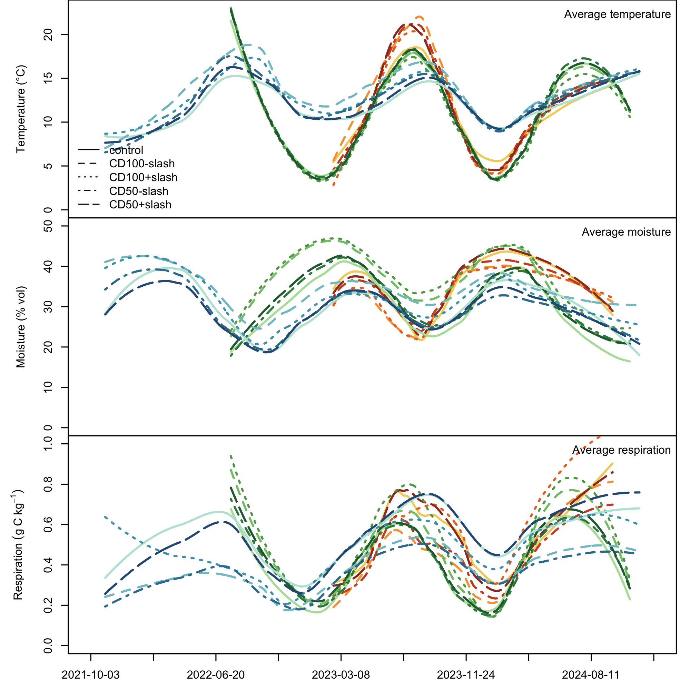
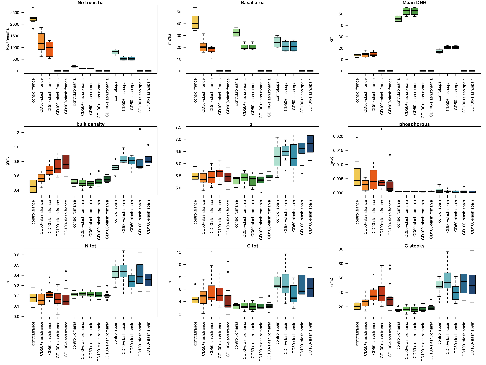
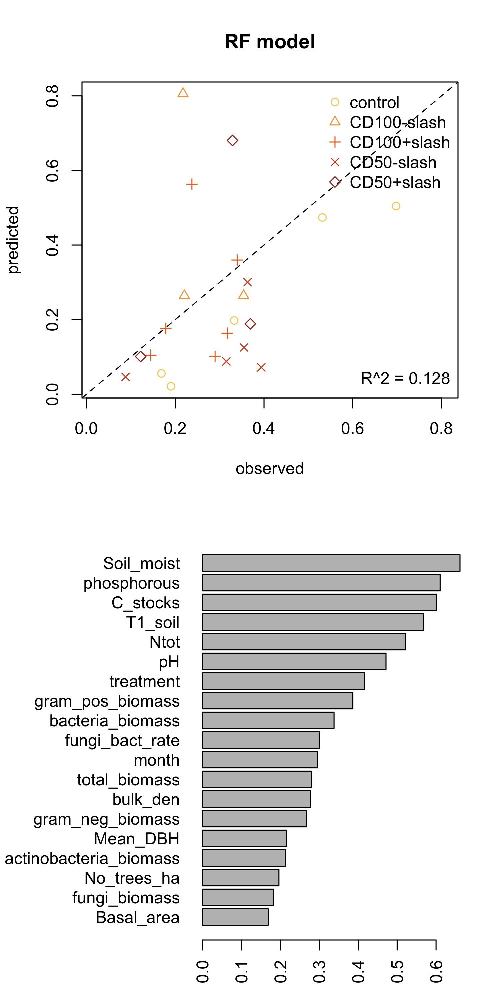
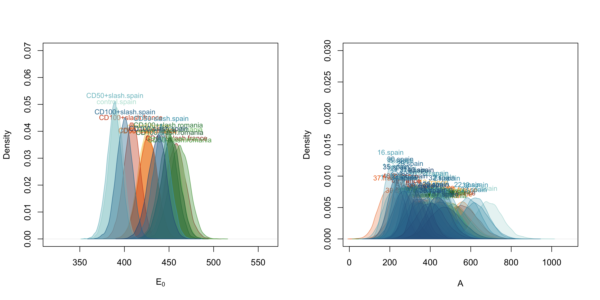
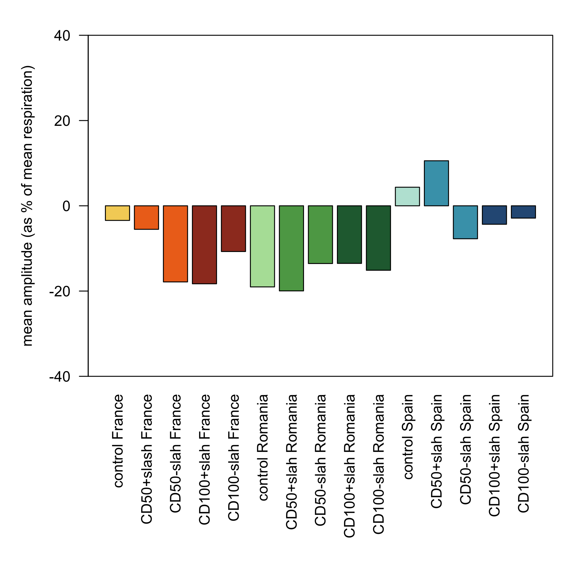

```{r setup, include=FALSE}
knitr::opts_chunk$set(echo = TRUE)
```

# Abstract


# Introduction
The soil is one of the largest terrestrial reservoirs of carbon, containing approximately three times more carbon than the atmosphere or the vegetation on Earth (IPCC, 2021). Soil carbon is released to the atmosphere as carbon dioxide (CO2) through decomposition of organic matter by microbes (heterotrophic respiration) and root respiration (autotrophic respiration). This process (i.e., soil respiration) constitutes the main carbon efflux into the atmosphere (ref). Under the new climate change scenarios increases of CO2 efflux from soils are expected (Schlesinger and Andrews, 2000), this can imply a positive feedback to future warming if stored carbon is mobilized and carbon input to soil does not increase (Lamberty&Thomson, 2010). Because soil respiration is highly sensitive to soil temperature and soil moisture (Nissan et al. 2022), understanding the responses of soil respiration to these microclimatic conditions, which are affected by global change factors as climate change and forest management, is critical for predicting future atmospheric CO2 concentrations. Temperature affects respiration rates positively (Lloyd and Taylor, 1994), by increasing the metabolic rates of soil microorganisms and enzyme efficiency (ref). However, the relationship with soil moisture is non-linear. Low water content limit nutrient diffusion and enzymes and exert drought-stress on microbes while high water contents limits oxygen (O2) diffusion, creating anaerobic conditions that suppress aerobic microbial respiration (ref). Something here about modelling?

Forest management have the potential to affect respiration rates by modifying the microclimate. Removal of trees by forest logging increases the exposure of soil to temperature fluctuations and alter the soil water content either by decreasing water through soil evaporation or by increasing it by reducing the transpiration of water by trees (Zhang et al 2018). The degree of the response of soil will be dependent on the severity of the forest intervention. Thus, more severe forestry intervention such as clear-cuts may increase soil moisture, enhance heat and frost damage (Kovaks et al 2019; Zhang et al 2018) and it seems to reduce respiration rates (Yang et el 2022; Zhang et al 2018). Less severe interventions such as thinning, have shown to increase respiration in broadleaf forests in a meta-analysis (Zhang et al 2018). Negative effects of forest management on soil could be buffered by the addition of forest residues on soil (i.e., slash addition), which can improve the microclimatic conditions, nutrient fertility and biodiversity (ref). We do not know whether the response of soil CO2 effluxes to the microclimatic conditions (i.e. soil temperature and moisture) differs among different forest management strategies. Understanding the sensitivity of respiration to microclimate under different forest management strategies is crucial in a context of climate-smart forestry (CSF) development.

Here, we hypothesized that logging of trees will decrease the respiration rates because of the strong decrease in vegetation activity and microbiota associated. In turn, addition of slash will provide labile organic matter to decompose increasing the respiration rates. We also hypothesized that the variation in soil respiration would be mainly dependent on microclimatic variables (soil temperature and moisture), especially in the management treatments where vegetation was removed, since heterotrophic respiration will prevail over autotrophic respiration. Moreover, the sensitivity of soil respiration to microclimatic conditions will depend on the type of climate/forest, being the Mediterranean the most sensitive as the microbial communities will be better adapted to the strong seasonal changes in water availability. 

To test these hypotheses, we have monthly recorded data on soil respiration and microclimate in three replicated Quercus forests across Europe subjected to different forest management strategies during three years. We have analysed the sensitivity of soil respiration to microclimate (i.e., soil temperature and soil moisture) by constructing a mechanistic model…


# Material and methods


## Study sites
The study sites are located in Gamiz, Northern Spain (42°49'2.32"N; 2°37'10.67"W), Saint-Christol-d’Albion, South of France (xxx) and Dumbravita, East Romania (42°49'2.32"N; 2°37'10.67"W). According to Köppen-Geiger climatic classification, the climate in Gamiz is Oceanic, with cold and rainy winters and warm summers. In St. Christol the climate is Mediterranean, with mild winters and warm and dry summers. In Dumbravita, the climate is humid continental with warm to hot summers, and cold and snowy winters with precipitation usually distributed throughout the year (Table 1). In the three study sites, the dominant vegetation are deciduous species of Quercus. Specifically, Quercus faginea Lam. in Gamiz, Quercus pubescens Willd. in St. Christol and Quercus robur L. in Dumbravita (Table 1). In St.Christol and Dumbravita the stands are Quercus monodominant, while in Gamiz, Quercus faginea appears together with scattered Acer campestris L. and Fraxinus excelsior L., and an understory dominated by Crataegus monogyna Jacq., Juniperus communis L. and Viburnum lantana L. More characteristics of the study sites are found in Table 1.
The experimental sites have an approximate total area of 1.5 ha. In each site, three stands of 0.12 ha each and replicated in four blocks were delimited. The stands corresponded to a control and two canopy disturbance treatments, i.e., 50% thinning and clear-cut (Fig. S1). The stands from disturbed treatments (thinning and clear-cut) were in turn divided in two: on half of the stands the slash resulting from the logging (leaves and twigs) was crashed and added on top of the soil and on the other half, the woody debris resulting from logging was removed. This made a total of 5 treatments (control, clear-cut with and without slash, thinning with and without slash) per block (Fig. S1). In each of the 5 treatments, two plots were established per block making a total of 40 plots (4 blocks x 5 treatments x 2 replicates per block; Fig S1). In turn, in each plot a transect of 2m length was established for monitoring (Fig. S1). Both the canopy disturbance and the slash addition treatments together with the fencing of the entire area were carried out in October 2021 in Gamiz, April 2022 in St. Christol and March 2022 in Dumbravita.

## Soil respiration 
To measure soil CO2 efflux (i.e., soil respiration), three rings of 10 cm diameter and 8 cm high were put along the 2 m transect in each of the monitoring plots (Fig. S1). Respiration was measured by a mobile infrared gas analyser (EGM-5, PP Systems, Hitchin, UK) and an attached soil respiration chamber (SRC-1). Soil CO2 efflux (g CO2 m-2 h-1) was calculated as linear increase in CO2 concentrations within the chamber headspace. The total volume used for calculation was the volume of the chamber plus the volume of the specific ring. Measurements were done monthly in the 120 collars in each site. Measurement in Gamiz started in November 2021, in St. Christol in February 2023 and in Dumbravita in May 2022.

## Forest stand characteristics
Within each of the control and thinned stands (n=8), we recorded the number of trees to calculate tree density (No. tree per ha) and measured tree diameter at breast height (DBH; 1.3 m) to calculate basal area.

## Microclimatic variables
We measured soil moisture and temperature using TMS data loggers version 4 (Wild et al., 2019), located at the extreme of the 2 m transect in each of the monitoring plots (Fig S1). These probes have three temperature sensors positioned at +15 cm, 2 cm and -6 cm relative to the soil surface, and a sensor that measures volumetric soil moisture based on time domain transmission to a depth of 6 cm. To convert the raw TMS measurements of soil moisture to volumetric soil water content, we used a calibration curve developed by Kopecký et al. (2021). For further modelling and since these sensors measure every 15 min, we extracted the soil temperature and soil moisture measurements closer to the time we measured soil respiration in the field.

## Soil physical-chemical analyses
Chemical analyses were measured on 5 soil cores of 4 cm diameter separated 0.5 m to a depth of 10 cm along the 2m monitoring transect. The five soil cores were mixed into a composite sample per plot. The composite sample was sieved through a 5-mm mesh sieve in the field, stored at -20°C and then freeze-dried prior to laboratory analyses. The pH was measured in distilled water 1:10 (w/v). The carbon (C) and nitrogen (N) content of the soil was measured using an elemental analyser: C content was measured by sulfochromic oxidation (ISO 14235), and N content was estimated by sulfuric acid mineralization with the addition of selenium and sodium sulphate and conversion to ammonium ions (ISO 11261), which were measured with the Segmented Flow Analyzer (SFA) Skalar. Available phosphorus (P) was determined after extraction with malachite green according to the protocol by Ohno & Zibilske (1991). Bulk density was measured in each of the plots by collecting 3 soil cores of 6 cm diameter and 10 cm depth around the 2m transect that were mixed into a composite sample. Soil bulk density was determined by dividing the dry mass of the composite sample by the volume of the 3 cores, after removing the stones. Soil C stocks (g m2) were calculated by multiplying C concentration by bulk density and sampling depth.

## Microbial biomass
The same five soil cores used for chemical analyses were used to estimate soil microbial biomass. To do that, we extracted Phospholipid fatty acids (PLFAs) following Šnajdr et al. (2008). Lipids were extracted using approximately 1g of dry soil with a mixture of chloroform:methanol:phosphate buffer (1:2:0.8) and separated by solid-phase extraction cartridges (HyperSep Silica SPE columns 200 mg/3 mL, Thermo Fisher Scientific). PLFAs were eluted using 2 mL of methanol. The selected fractions underwent to mild alkaline methanolysis and the methyl esters of PLFAs were analyzed by gas chromatography-mass spectrometry (GC-MS; 450-GC, 240-MS ion trap detector, Varian, Walnut Creek, CA). In the polar PLFA fraction, fungal biomass was quantified based on 18:2ω6,9 (fungal PLFA) content; bacterial biomass (total bacterial PLFA) was quantified as a sum of i14:0, i15:0, a15:0, 16:1ω5, 16:1ω7, 16:1ω9, 10Me-16:0, i16:0, i17:0, a17:0, cy17:0, 17:0, 10Me-17:0, 18:1ω7, 10Me-18:0, cy19:0 (Actinomycetes 10Me-16:0, 10Me-17:0, 10Me-18:0, Gram-positive i14:0, i15:0, a15:0, i16:0, i17:0, a17:0 and Gram-negative 16:1ω7, 16:1ω9, 18:1ω7, cy17:0, cy19:0). The sum of all of the selected PLFAs together with 16:0 and 18:1w9 was used as an estimate of total microbial biomass (total PLFA). 


## Data pretreatment


## Validation
In order to ensure a robust validation, all models have been validated with a split approach, keeping two completely independent data sets (80% of the points for training and 20% validation). Given the size of the dataset, we considered this approach more reliable than any crossvalidation approach.


## Parametric model, constant `E_a`
We defined a parametric model to consider all the three effects on respiration we hypothesized. The first is the influence of temperature, then the influence of soil moisture, and then a seasonal component which is assumed to be roughly proportional to the interactions of autotrophic respiration (which we hypothesized following a seasonal pattern).
Temperature and moisture scaling interact linearly, while seasonality was assumed additive:  
$$
Rh(t) =  \xi_{temp(t,j, k)} \cdot \xi_{moist(t,j)} + \xi_{sin(t,j)}
$$

Where the index $j$ corresponds to the treatments and the index $k$ corresponds to the plots (minimal statistical unit), while $(t)$ denotes the variation over time of each forcing variable (temperature, moisture, or days of the year).

## Model calibration
The parametric model was calibrated in a stratified Bayesian framework, where we assigned independent parameters depending on different groping of the data.   
The model was written in Stan [@carpenter2017stan; @standev2018stancore], run from its R interface [@Rstan].
The likelihood function was defined as:  
$$
    Rh_{meas} \sim \mathcal{N}(Rh_{sim}, \sigma)
$$
Where the parameter $\sigma$ was defined as the variance of the whole dataset (0.27).

### Moisture 
The moisture scaling function was taken from a simplified version of Moyano (2013) in the SoilR package [@SierraMueller].
$$
\xi_{moist(t,k)} = a_j \cdot \theta_{v}(t) - b_j \cdot (\theta_{v}(t))^2
$$
We assumed that the variability in moisture sensitivity is driven by treatments ($j$). 
The prior distribution for the term $a$ was assumed as $\sim \mathcal{N}(3.11, 0.1)$ and for the term $b$ was assumed as $\sim \mathcal{N}(2.42, 0.1)$, utilizing as mean values the values in @SierraMueller and setting up conservatives standard deviations.

  
### Temperature
The temperature scaling function we utilized to define the relationship is the one defined by @Lloyd.1994l68 and it is derived from the original Arrhenius equation [Arrhenius.1889]:
$$
\xi_{temp(t,j)} = A_{k} \cdot e^{\frac{-Ea_j}{(T(t)+273.15)-T_0)}}
$$
The two parameters $A_{k}$ and $E_a$ are represented by Bayesian priors.  
For the temperature scaling we assumed that the activation energy term $E_a$ (which defines roughly the slope of the relationship) is driven by treatments ($j$) while the linear rescaling term $A_{k}$ is driven by the substrate at the single plot level ($k$). This because substrate (organic matter) amount is usually highly variable in soil even at small spatial scales, while its quality, which defines its temperature sensitivity, is assumed to follow the inputs quality which are relatively uniform over each treatments.  
The effect of the rescaling term $A_{k}$ is included in the function for temperature scaling to keep the convention of the original formulation of the equation, but it could be brought outside since it just a linear interaction.  
The prior distribution for the term $A$ was assumed as $\sim \mathcal{N}(300, 100)$ and for the term $E_a$ was assumed as $\sim \mathcal{N}(398.5, 50)$, utilizing as mean values the values  in @Lloyd.1994l68 and setting up conservatives standard deviations.


### Seasonality
In order to correct for eventual seasonality patters, we introduce also a seasonality scaling.
The seasonality scaling functions assume a sine function with period = 365 days, with both amplitude $ampl_j$ (the magnitude) and peak day $peak_j$ (when the function is at its only annual peak) varying as a function of treatments:
$$
\begin{aligned}
    \xi_{sin(t,k)} = ampl_k \cdot sin \left(\frac{2 \cdot \pi}{365}\right) \cdot day(t) \\
    +\left(\frac{2 \cdot \pi}{365}\right) \cdot (peak_k - 1) - \frac{\pi}{2})
\end{aligned}
$$
Both the terms $ampl_j$ and $peak_j$ are described by Bayesian priors. Variance is by treatment.
We assumed that the variability in seaslonalityis driven by treatments ($j$). 
The prior distribution for the term $ampl$ was assumed as $\sim \mathcal{N}(0, 0.5)$, so assuming as mean no seasonality effect, and for the term $peak$ was assumed as $\sim \mathcal{N}(175, 50)$, so assuming as mean for the peak the 24th of June (Midsummer day). Amplitude can be negative (this is just reverting the order of peaks and valleys of the sine function).


## Model benchmark
The parametric model has been compared against two nonparametric machine learning models. The firs was a more conventional multiple linear regression model (default R package `lm`, @R-Core-Team_2023), and the second a random forest model (command `randomForest` from package `randomForest`, @randomForest_2021). Both models had the structure as:  
$$
Rh(t) \sim f(T(t), theta_v(t), treatment)
$$
The rationale behind these choices is to offer two extremes to compare the fitness of our parametric model with, assuming that a linear regression model will perform more poorly than the parametric model given its limited capabilities to represent relationships more complex than linear (as we assume temperature and moisture relationships with respiration), and that a random forest model will perform better than the parametric model given its plasticity. The random forest model was in this case fit with default parameters, without any other optimization.

## Model extrapolation of increased temperature effect on decomposition
Once we calibrated our parametric model, we could test the consequences of an increase in temperature on decomposition by driving the model with the same dataset except temperature was increased by 5&deg;C. This resulted in a more immediate way of visualizing the impact of a different temperature sensitivity of organic material.


## Parametric model, time-variant `E_a`
In order to test the hypothesis of an eventual variation of the activation energy of the decomposing material over time without any assumption on the function of variation, we fitted a version of the model where the $E_a$ parameter was stratified in order to let it vary independently for each treatment and year of sampling. 


```{r, echo=FALSE}
# Load necessary package
library(knitr)

# Create the data frame
df <- data.frame(
  Parameter = c("A", "Ea", "a", "b", "amplitude", "peak_day"),
  Description = c(
    "Pre-exponential factor (log)", 
    "Activation energy (Ea/R)", 
    "Scaling of Moyano function (moisture, linear term)", 
    "Scaling of Moyano function (moisture, quadratic term)", 
    "Amplitude of seasonal sine wave", 
    "Peak day of seasonal sine wave"
  ),
  `Stratification Level, const Eₐ` = c(
    "Plot", 
    "Treatment", 
    "Treatment", 
    "Treatment", 
    "Treatment", 
    "Treatment"
  ),
  `Stratification Level, var Eₐ` = c(
    "Plot", 
    "Treatment-year", 
    "Treatment", 
    "Treatment", 
    "Treatment", 
    "Treatment"
  ),
    `Prior Values` = c(
    "normal(30, 100)", 
    "normal(398.5, 50)", 
    "normal(3.11, 0.1)", 
    "normal(2.42, 0.1)", 
    "normal(0, 0.25)", 
    "normal(175, 50)"
    )
)

# Generate the table using kable
kable(df, format = "pipe", caption = "Model parameters stratification and priors")
```

## Machine learning variance decomposition
On a more limited subset (only Spain), we tested a more extensive random forest model in order to test the predictive power of other variables on the respiration. The model had structure as:  
$$
\begin{aligned}
Rh(t) \sim f(trees,  treatment, DBH, BA, pH, BD, 
P, N, C_{stocks}, \text{fungi\_biomass}, 
biom_{fungi}, biom_{bact},\\
biom_{act},biom_{gram+}, biom_{gram-}, 
biom_{tot}, \frac{biom_{fungi}}{biom_{bact}}, 
T_{soil}, M_{soil}, month)
\end{aligned}
$$

We included in this model tree density in plants ha$^{-1}$ ($trees$), average diameter at breast height ($DBH$), basal area ($BA$),  pH, bulk density ($BD$), phosophorous ($P$), total nitrogen ($N}$), carbon stocks ($C_{stocks$), fungal biomass ($biom_{fungi}$), bacterial biomass ($biom_{bact}$), actinomycetes biomass ($biom_{act}$), gram+ bacterial biomass ($biom_{gram+}$), gram- bacterial biomass ($biom_{gram-}$), total biomass ($biom_{tot}$), fungi:bacteria ratio, soil temperature ($T_{soil}$), soil moisture  ($M_{soil}$) and month of the year.
This model was tested only on a subset of the dataset (only the sites in Spain), for which all the additional variables were available.
The aim of this model was to test the predictive potential of any of these additional variables, in order to to explore eventual correlations and possible related processes. The choice of a random forest model over a more conventional linear model is motivated by the capacity of the former to consider more complex relationships and interactions, on top of the convenience of being able to assess quantitatively the predictive potential of each variable by estimating relative variable importance.

## Machine learning variance decomposition on enzymes
$$
\begin{aligned}
Rh(t) \sim f(trees, treatment, BA, BD, \\
\beta_{\text{gluco}}, \text{acid\_phos}, \beta_{\text{xylo}}, \text{chitise}, \\
\text{cellobiohydrolase}, \beta_{\text{galacto}}, \alpha_{\text{gluco}}, \text{lipase}, \\
\text{CO}_2\text{\_flux\_norm}, T_1\text{\_soil}, \text{Soil\_moist}, \text{month})
\end{aligned}
$$


# Results

## Sites microclimate
{width=60%}

## Edaphic and biological variables
{width=80%}
{width=80%}


## Benchmark models and parametric model fit
{width=80%}


{width=60%}


## Parametric model posteriors, constant `E_a` 

{width=60%}


## Parametric model posteriors,  time-variant `E_a` 
{width=60%}


## Machine learning variance decomposition: predicting respiration based on edaphic, ecological and enzymatic data

{width=50%}

{width=50%}


## Model extrapolations

{width=60%}


# Discussion

## Role of temperature and moisture in conditioning decomposition
Temperature and moisture seem the most important components in explaining the variance of the soil respiration. The seasonality scaling, although apparently differentiating slightly between sites, presents always very low amplitude posteriors, weighting on average only a 5% of the total measured respiration. It was more important in France (between 4.5% and 12.2%) and much less in Spain and Romania (between 2.0% and 3.2%). This seasonality might represent many different processes, but the most likely are seasonal processes connected with the above-ground vegetation and their inputs to the soil, which in turn would control microbial communities.


## Activation energy of different organic material


## Role of edaphic, ecological and microbiological variables in conditioning decomposition
Any other variable than soil temperature and moisture did not seem to play a pivotal role in explaining the variance of the soil respiration.


## Consequences of different temperature sensitivity of organic material in reacting to warming


# Conclusions


# References
\bibliography{references}


# Appendix
{width=60%}








{width=50%}


{width=50%}


{width=50%}


```{r, echo=FALSE}
library(knitr)
anova_results <- read.csv("../Tables/Enzyme_means.csv", stringsAsFactors = FALSE)
kable(anova_results, escape = FALSE, caption = "Table 1: ANOVA Results for enzyme activities")
```


```{r, echo=FALSE}
library(knitr)
anova_results_edaph <- read.csv("../Tables/Edaphics_means.csv", stringsAsFactors = FALSE)
kable(anova_results_edaph, escape = FALSE, caption = "Table 1: ANOVA Results for edaphic and ecological variables")
```
